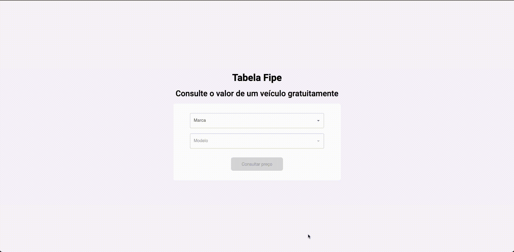
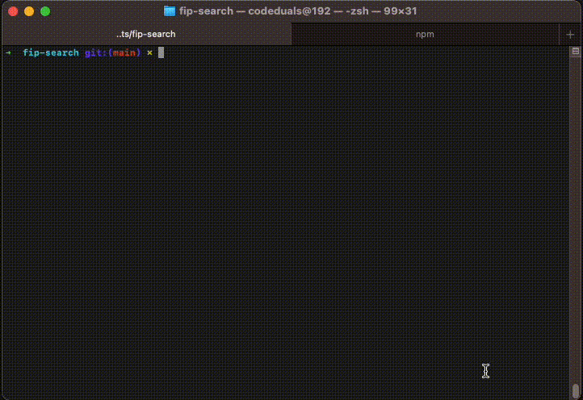

<h1 align="center">Car Prices Search App</h1>

    
    

## O que é esse projeto?
Esse projeto consiste em um buscador de preços de automoveis na tabela FIPE. Este projeto consome os dados da [FIPE API](https://deividfortuna.github.io/fipe/) desenvolvida por [@deividfortuna](https://github.com/deividfortuna/fipe).

## Setup Rápido
*Primeiramente tenha certeza que voce possuí [Node](https://nodejs.org/en) instalado em seu computado, versão 18 ou superior.
1. Faça o download ou clone o projeto e extraia
2. Rode o comando `npm install` para instalar todas as dependencias do projeto
3. Crie um `.env` na raíz do seu projeto e adicione a URL base como variável de ambiente `NEXT_PUBLIC_API_URL=https://parallelum.com.br/fipe/api/v1/carros/marcas`, basta copiar do arquivo `.env.example`
4. Agora basta rodar o comando `npm run dev` e acessar o aplicativo em seu browser [http://localhost:3000](http://localhost:3000)

## Vercel
[✓] Instalado e rodando na [Vercel](https://fipe-search.vercel.app/) 🚀

## Características
- Next.js
- Context API
- Typescript
- Testes unitários usando Jest + React Testing Library nos arquivos de contextos, hooks, páginas e componentes
- Husky com pre-commit configurado para rodar todos os testes e o lint em "staged files" antes de cada commit, com intuito de manter a consistência do projeto
- [MUI](https://mui.com/material-ui/react-stack/) com [emotion](https://emotion.sh/docs/introduction)

## Testes

Caso queira rodar os testes manualmente, basta rodar o comando `npm test`.

Caso deseje rodar automaticamente, basta criar um commit qualquer e deixar o Husky pre-commit fazer o trabalho dele. 

